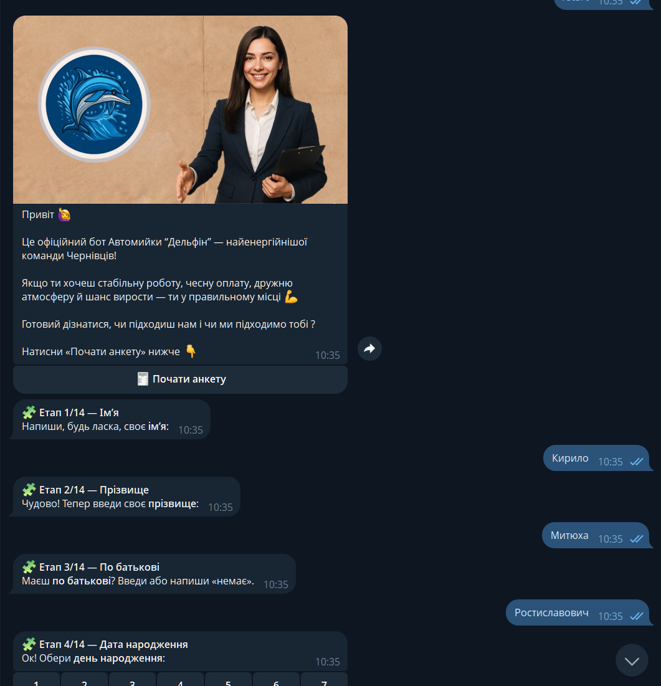
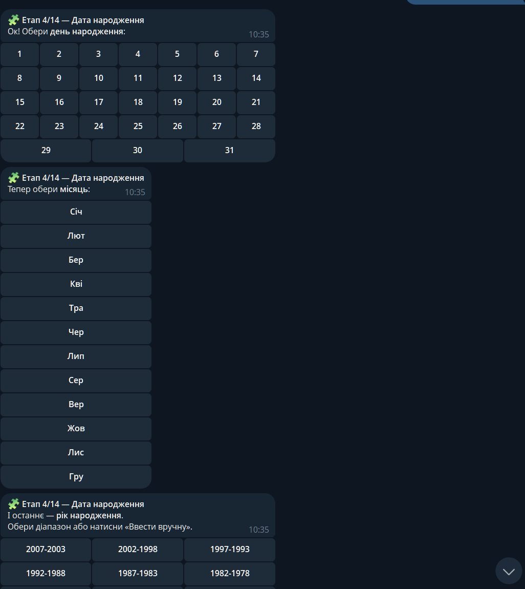
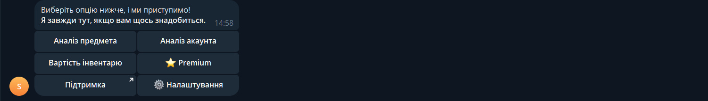
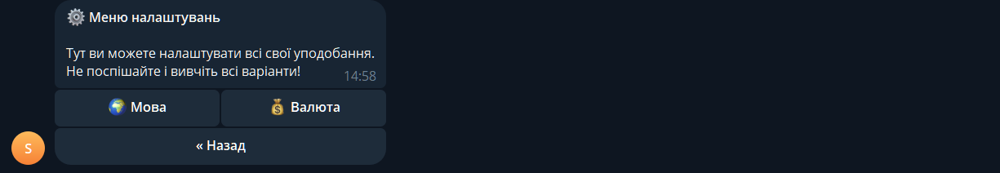
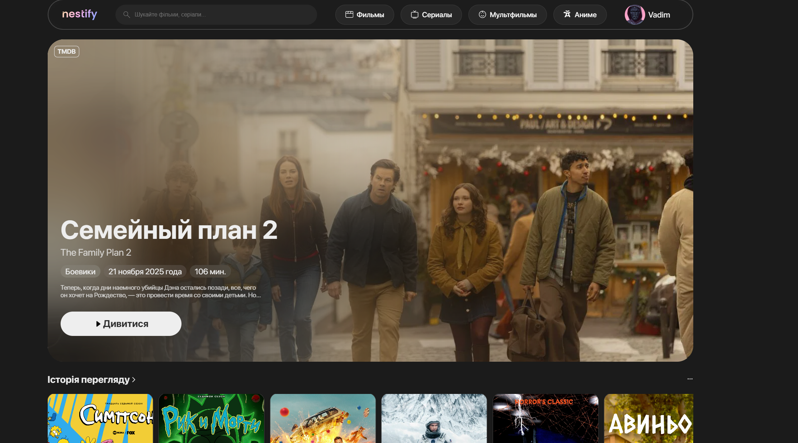
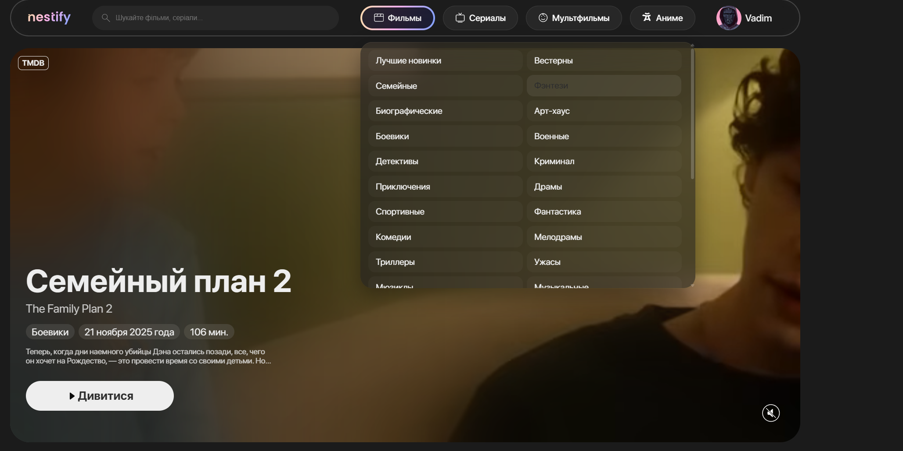
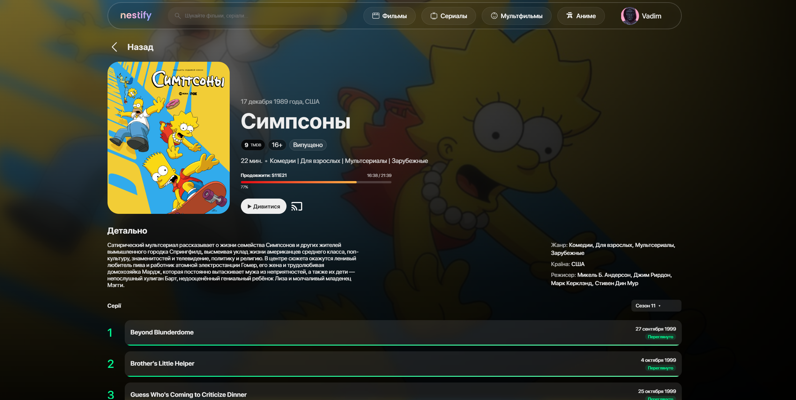
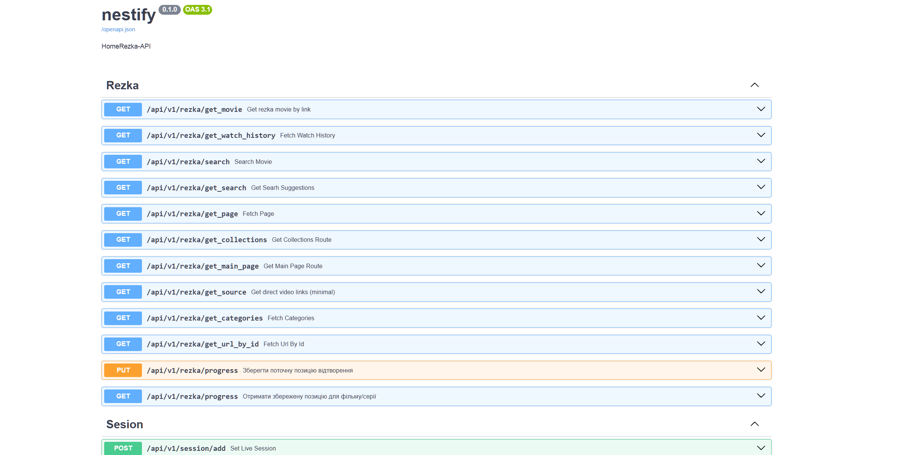
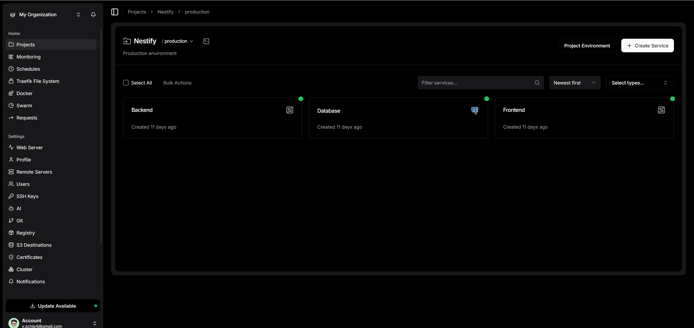

# Портфоліо проєктів

---

## 🔍 OSINT-бот для пошуку людей по фото — `@ulosint_bot`

Бот дозволяє знайти людину за її фотографією, використовуючи інтеграцію з зовнішнім OSINT-API.

### Основні можливості

- Завантаження фото прямо в чаті з ботом.
- Відправка зображення на сторонній OSINT-сервіс через безпечне API.
- Отримання списку можливих збігів з короткою інформацією:
  - посилання на профілі,
  - ім’я / нік,
  - додаткові метадані (якщо їх повертає API).
- Зручний формат результатів у вигляді повідомлень або інлайн-карток.
- Логування запитів (з можливістю анонімізації) для внутрішньої статистики.

### Для чого підходить

- OSINT-дослідження.
- Перевірка фейкових акаунтів.
- Пошук додаткових профілів людини в мережі.

---

## 💼 Бот для автомийки “Дельфін” — збір заявок та анкетування

`@dev12342x_dolphin_bot`

Бот використовується як HR-та CRM-інструмент для автомийки: збирає заявки від кандидатів, структурує інформацію та спрощує відбір персоналу.

### Що вміє бот

- Привітальне повідомлення з описом команди та умов роботи.
- Кнопка **«Почати анкету»** — запуск поетапного заповнення форми.
- Покрокове анкетування (14 етапів), наприклад:
  - Ім’я, прізвище, по батькові.
  - Дата народження (зручний вибір дня/місяця/року через інлайн-кнопки).
  - Контактні дані та месенджери.
  - Досвід роботи, графік, бажаний рівень оплати.
- Валідований ввід (де треба — тільки кнопки, без “вільного тексту”).
- Збереження всіх відповідей у структурованому форматі (БД / Google Sheets / адмін-панель — залежно від інтеграції).
- Сповіщення адміністрації про нову заповнену анкету.

### Для бізнесу це дає

- Менше хаосу в особистих повідомленнях.
- Уніфіковані анкети — легше порівнювати кандидатів.
- Частину роботи HR закриває бот: він чітко веде людину за сценарієм, не забуває жодного питання.

---

## 🎮 Steamy — приватний бот-радник по ринку Steam (Dota 2 / CS:GO)

Steamy — це мій приватний Telegram-бот для моніторингу ринку Steam:  
аналіз цін, ліквідності, флоату та потенційної вигоди для скіна чи інвентарю.

### Ключовий функціонал

- **Аналіз предмета**

  - Порівняння цін на різних майданчиках.
  - Перевірка ліквідності (як швидко можна продати).
  - Графік динаміки цін (історія змін).

- **Аналіз акаунта**

  - Оцінка вартості інвентарю.
  - Виділення найбільш ліквідних та “преміум” предметів.

- **Сповіщення**

  - Алерти про зміну ціни.
  - Нагадування про цікаві пропозиції або наближення цільової ціни.

- **Додаткові інструменти**
  - Перевірка якості предмета (Float Info).
  - Пошук кращих пропозицій за флоатом / ціною (Best Float Search).

### Налаштування та персоналізація

- Окреме меню **«Налаштування»**:
  - вибір мови;
  - вибір валюти для відображення цін;
  - конфігурація частоти сповіщень.
- Опція **Premium** — закладка під майбутню монетизацію:
  - розширені ліміти запитів,
  - додаткові типи аналітики,
  - пріоритетні сповіщення.

Steamy зараз використовується як особистий інструмент трейдингу, але має всі передумови для масштабування в публічний сервіс.

---

## 🎬 Nestify / OpenCine — приватний онлайн-кінотеатр

`https://opencine.cloud`

Nestify — мій кіно-проєкт у форматі приватного “домашнього Netflix”:  
власний сайт-кінотеатр з красивим інтерфейсом, збереженням прогресу перегляду та інтеграцією з Kodi / домашнім кінотеатром.

### Функціонал фронтенду

- **Головна сторінка**

  - Великий **hero-банер** з фільмом дня/новинкою.
  - Жанрові секції, добірки та історія перегляду.
  - Адаптивний дизайн в стилі Apple / Netflix (темна тема, заокруглені блоки, blur-ефекти).

- **Каталог**
  - Окремі вкладки: _Фільми_, _Серіали_, _Мультфільми_, _Аніме_.
  - Фільтрація за жанрами, країнами, роками.
  - Категорії з TMDB / власного API.

- **Сторінка фільму / серіалу**
  - Постер, опис, країна, жанри, режисери.
  - Прогрес перегляду (бар, що показує, доки додивився).
  - Для серіалів — список сезонів і серій з позначкою “Переглянуто”.
  - Кнопка **«Дивитися»** з можливістю відтворення на сайті або відправки в домашній плеєр (Kodi / Nestify Player / Chromecast).

### Backend та API

Backend реалізований на **FastAPI** з добре задокументованим REST-API (Swagger/OpenAPI).

Основні можливості API:

- Парсинг і проксі-доступ до контенту Rezka (фільми, серіали, колекції, сторінки).
- Маршрути:
  - `/api/v1/rezka/get_movie` — отримати деталі фільму.
  - `/api/v1/rezka/get_main_page` — сформувати головну.
  - `/api/v1/rezka/get_collections`, `/get_categories`, `/search` тощо.
  - `/api/v1/rezka/get_source` — отримати прямі лінки для програвача.
  - `/api/v1/rezka/progress` (GET/PUT) — збереження та отримання позиції перегляду.
- **Сесії перегляду**: окремі ендпоінти для збереження активної сесії (що зараз дивишся).

### Інфраструктура та деплой

Для деплою використовую **Dokploy** як панель керування інфраструктурою.

- Окремі сервіси:
  - **Backend** (FastAPI).
  - **Database** (PostgreSQL).
  - **Frontend** (React / Next / SPA, залежно від гілки).
- Запуск у Docker-контейнерах, зручне керування:
  - перезапуск сервісів,
  - оновлення образів,
  - моніторинг статусу.

### Коротко про стек

- **Фронтенд:** React (SPA), кастомний UI в стилі стрімінгових сервісів.
- **Бекенд:** FastAPI + SQLAlchemy.
- **База даних:** PostgreSQL.
- **Парсинг:** власні парсери Rezka.
- **Деплой:** Docker + Dokploy + VPS.
- **Ідея:** зробити свій “домашній Netflix” з інтеграцією в розумний дім (Kodi, WLED, проектор, тощо).

---

Якщо треба, можу винести будь-який проєкт в окремий README.md (з технічним стеком, діаграмами, схемами БД) або підготувати версію тексту під портфоліо/резюме.
